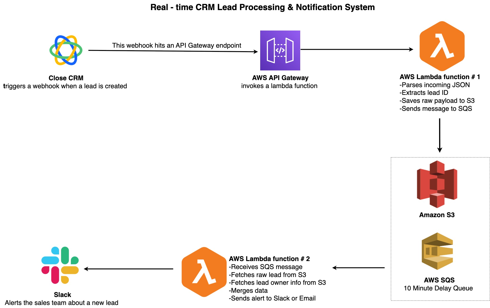

# Automated Lead Assignment & Notification System (AWS \+ Close CRM)

## Introduction

Sales teams often rely on how quickly they react to a new lead. In **Close** CRM the creation of a lead does not automatically assign that lead to a sales representative, and the assignment can occur several minutes after the lead appears. If the sales team jumps on a lead before the owner has been assigned then the wrong person may follow up, causing confusion and missed opportunities. 

This project implements a small, serverless pipeline on AWS that ingests lead creation events from Close CRM via a webhook, waits for a short buffer period of 10 minutes, enriches the lead with owner information and notifies the team in real‑time via Slack notification.

## Architecture at a Glance

At a high level the pipeline consists of the following components:

1. **Close CRM Webhook** – When a new lead is created in Close, the CRM calls a webhook URL with a JSON payload describing the lead.

2. **Amazon API Gateway (HTTP API)** – Receives the webhook request and forwards it to the first Lambda function.

3. **Lambda \#1 – webhook‑ingest** – Parses the incoming JSON, extracts the lead\_id, stores the raw event into an S3 bucket and queues a message onto an Amazon SQS delay queue. The delay queue introduces a 10‑minute pause to allow the CRM to assign a lead owner.

4. **Amazon SQS Delay Queue** – Holds messages for 10 minutes. After the delay expires the message becomes visible to the second Lambda function.

5. **Lambda \#2 – enrich‑alert** – Receives messages from SQS, fetches the raw lead data from S3, looks up the lead‑owner data from a publicly accessible S3 bucket, merges the data, writes the enriched JSON back to S3 and sends a formatted alert to Slack (or email).

## Prerequisites

To reproduce this project you will need:

* **AWS Account** – with permissions to create S3 buckets, SQS queues, Lambda functions, IAM roles and API Gateway resources.

* **Slack Workspace** – with permission to create an *incoming webhook*. The webhook URL will be stored as an environment variable.

* **Close CRM** – access to create webhook subscriptions (or a team member who can create them on your behalf). You only need the subscription to fire on **lead creation** events.

* **Python 3.9** (or compatible) – used for the Lambda functions. The provided scripts have no third‑party dependencies, so they work with the standard AWS Lambda Python runtime.

## Step‑by‑Step Setup

Follow the instructions below to provision the necessary AWS resources and deploy the two Lambda functions. The section headings map to the architecture diagram above.

### 1 – Create an S3 bucket for raw events

Create an S3 bucket in the same region as your Lambda functions (for example us‑east‑1). The bucket name used in the example code is crm-webhook-events, but you may choose any globally unique name. This bucket will store two sets of objects:

* **Raw lead events** – Stored at the top level with the naming convention crm\_event\_{lead\_id}.json 

* **Enriched events** – Written by the second Lambda into the enriched/ prefix to keep them separate from the raw data.

Do not enable S3 event notifications on this bucket; the delay is implemented via SQS instead.

### 2 – Provision an SQS delay queue

Navigate to the **Amazon SQS** console and create a new queue. Select the *Standard* queue type and call it something like lead-processing-delay-queue. Under **Delivery delay** set the *Delay Seconds* to 600 (10 minutes); this causes any message sent to the queue without an explicit per‑message delay to become visible only after 600 seconds.

Open the queue and copy its **URL**. You will need this value as SQS\_QUEUE\_URL in the environment of the first Lambda. 

### 3 – Deploy Lambda \#1: webhook‑ingest

1. **Create an IAM role** for the function with the following permissions:

2. s3:PutObject on your raw events bucket (crm-webhook-events).

3. sqs:SendMessage on the delay queue you created. The AWS console can generate an execution role that includes basic Lambda logging; attach an inline policy allowing the s3:PutObject and sqs:SendMessage actions on the specific resources.

4. **Create a new Lambda function** named webhook-ingest using the Python 3.9 runtime. Upload the lambda1(webhook-ingest).py script as the function code. Set two environment variables:

5. SQS\_QUEUE\_URL – the URL copied from your SQS queue.

6. (Optional) AWS\_REGION if you choose to override the default region.

7. **Configure the handler** to lambda1(webhook-ingest).lambda\_handler.

The webhook‑ingest function performs the following operations:

* Parses the incoming HTTP request body and extracts the lead\_id from the Close event payload.

* Writes the raw JSON payload into your S3 bucket with the key crm\_event\_{lead\_id}.json.

* Sends a message to the SQS delay queue containing the lead\_id and S3 object key. The message itself does not specify a per‑message delay (the queue’s default of 600 seconds is used).

* Returns a 200 HTTP response to API Gateway confirming storage and queuing.

The **Function overview** in the AWS console should show an API Gateway trigger attached to the Lambda.

### 4 – Configure API Gateway

Create a new **HTTP API** in Amazon API Gateway (not a REST API). Under **Routes**, add a POST route such as /webhook/lead. Select your webhook‑ingest Lambda function as the integration target. Deploy the API to a stage (e.g. prod) to obtain an invoke URL.

Once deployed, copy the fully qualified endpoint URL (e.g. https://\<api-id\>.execute-api.us-east-1.amazonaws.com/prod/webhook/lead). Provide this URL to your Close CRM administrator when creating the webhook subscription. The Close webhook should be configured to trigger on **lead creation** events and send the full payload as JSON.

### 5 – Deploy Lambda \#2: enrich‑alert

1. **Create an IAM role** for the second function with these permissions:

2. s3:GetObject and s3:PutObject on your raw events bucket.

3. logs:CreateLogGroup, logs:CreateLogStream and logs:PutLogEvents for CloudWatch logging. This role does not require permissions for SQS — the trigger automatically grants the Lambda service permission to poll messages.

4. **Create a new Lambda function** named enrich-alert using the Python 3.9 runtime. Upload the lambda2(enrich-alert).py script as the function code. Set the following environment variables:

5. RAW\_BUCKET – the name of your raw events bucket (e.g. crm-webhook-events).

6. SLACK\_WEBHOOK – the Slack incoming webhook URL (see below).

7. **Configure the handler** to lambda2(enrich-alert).lambda\_handler.

8. **Add an SQS trigger**. In the Lambda console choose **Add trigger** → **SQS** and select the delay queue created earlier. Leave the batch size at 1 for simplicity.
   
The enrich‑alert function performs the following:

* Reads messages from the SQS queue and parses lead\_id and s3\_key.

* Fetches the corresponding raw event from S3.

* Looks up the lead owner data from the public bucket supplied by the organization by requesting https://{public-bucket-name}.s3.us-east-1.amazonaws.com/{lead\_id}.json. A small helper (fetch\_with\_retries) implements exponential back‑off retries for transient HTTP errors.

* Merges the raw event and owner data and writes the enriched JSON into the enriched/ prefix of your raw bucket.

* Constructs a Slack message containing the lead’s name, ID, created date, status label, email, owner and funnel, and posts it to the Slack webhook.

### 6 – Set up a Slack incoming webhook

If you haven’t already, create a **Slack App** in your workspace and enable the *Incoming Webhooks* feature. Add a new webhook for the channel where you want to receive lead alerts (e.g. \#lead-alerts). Copy the generated webhook URL and set it as the SLACK\_WEBHOOK environment variable for the enrich-alert Lambda.

The Slack messages sent by the system follow the format specified in the project requirements.

### 7 – Configure the Close CRM webhook

Use the Close API or the web interface to create a new webhook subscription pointing at the API Gateway endpoint created earlier. The subscription should fire on lead **creation** events. Close CRM will deliver a JSON payload similar to the sample in the project documentation. Note that the lead\_id is nested at event.lead\_id or event.data.id depending on the webhook version; the first Lambda handles both cases.

### 8 – Test the end‑to‑end pipeline

To verify the system before enabling the live Close webhook you can manually post a sample event to the API Gateway endpoint. Use a tool like curl or Postman to send a POST request with a JSON body. After posting:

1. **Check S3** – A new object named crm\_event\_{lead\_id}.json should appear in your bucket within a few seconds. Verify its contents.

2. **Wait 10 minutes** – After the delay expires the second Lambda executes. The enriched JSON should appear at enriched/crm\_event\_{lead\_id}.json in the same bucket. Compare it against the raw event to confirm that owner information has been merged.

3. **Inspect Slack** – A message should arrive in the configured channel, formatted as shown above. Ensure that all fields – name, lead ID, created date, status label, email, lead owner and funnel – are present and correct.

### 9 – Monitor and troubleshoot

* **CloudWatch Logs** – Both Lambda functions emit logs to CloudWatch. In case of failures (e.g. invalid JSON, missing lead owner file, Slack webhook errors) consult the logs to understand the root cause.

* **Dead‑letter queues** – For production systems consider adding a dead‑letter queue to the SQS trigger so that unprocessed messages aren’t lost.

* **Error handling & retries** – The second Lambda includes a retry‑with‑back‑off helper when fetching owner files. You can extend this pattern for posting to Slack or reading from S3.

## Success Criteria (Checklist)

When implemented correctly the system should meet all of the following criteria from the project brief:

* **Fast ingestion** – New leads are captured by the webhook and stored in S3 within seconds of creation.

* **Delayed owner assignment** – The lead is processed only after the 10‑minute pause, ensuring that the CRM has assigned the owner.

* **Accurate enrichment** – Owner data is looked up by lead\_id and merged into the lead event without mismatches.

* **Real‑time notifications** – The team receives Slack (or email) notifications containing the required fields, matching the example format in the project specification.

* **Scalability** – Because SQS and Lambda are serverless, the system can process many leads concurrently. There are no race conditions because messages are handled independently.

## Clean‑up

To avoid ongoing charges on AWS delete the resources when you are finished testing:

1. Remove the webhook subscription from Close CRM.

2. Delete the two Lambda functions and their IAM roles.

3. Delete the API Gateway and its stage.

4. Purge and delete the SQS queue.

5. Empty and delete the S3 bucket(s).

## Next Steps

This solution is intentionally lightweight, but it can be extended. One could add richer validation, support other CRM systems, or send notifications via different channels (email, SMS, etc.). 
